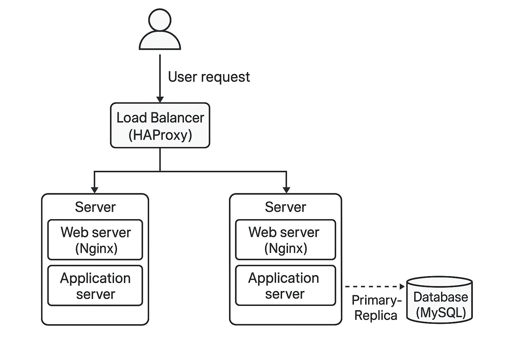

# Distributed Web Infrastructure

## How it works

1. **User request**: A user visits www.foobar.com.

2. **DNS**: The domain name www.foobar.com resolves to the IP of the **load balancer** using an A record. The domain allows users to reach the infrastructure without knowing the individual server IPs.

3. **Load Balancer (HAProxy)**:
   - Distributes incoming HTTP/HTTPS requests across two web servers.
   - Configured with a **round-robin algorithm**, meaning requests are sent alternately to each server.
   - **Active-Active setup**: Both servers receive traffic simultaneously (better utilization and redundancy).
   - **Active-Passive setup**: Only one server receives traffic, the other is on standby in case of failure.

4. **Web Servers (Nginx)**:
   - Each server handles HTTP requests and serves static files.
   - Forwards dynamic requests to the application server on the same machine.

5. **Application Servers**:
   - Processes application logic and interacts with the database.

6. **Databases (MySQL Primary-Replica)**:
   - **Primary node**: Handles write operations (INSERT, UPDATE, DELETE).
   - **Replica node**: Handles read operations (SELECT) to reduce load on the primary.
   - Data is replicated from Primary to Replica automatically, providing redundancy and read scalability.

7. **Communication**:
   - The load balancer and servers communicate with the user's browser via HTTP/HTTPS.
   - Internal servers communicate using TCP/IP for web and database connections.

---

## Why additional elements are added

- **Load Balancer**: Ensures traffic is distributed, improves uptime, and prevents a single server from being overwhelmed.
- **Second server**: Provides redundancy and allows scaling for more users.
- **Replica database**: Improves read performance and provides redundancy in case the primary fails.

---

## Limitations and Issues

- **Single Points of Failure (SPOF)**:
  - Load balancer itself can be a SPOF if only one exists.
  - Primary database node is critical; if it fails, writes are unavailable until failover.
  
- **Security Issues**:
  - No firewall rules or HTTPS setup, so communication is unencrypted and servers are exposed.
  
- **No monitoring**:
  - Cannot detect or alert on failures, high load, or unusual activity.

