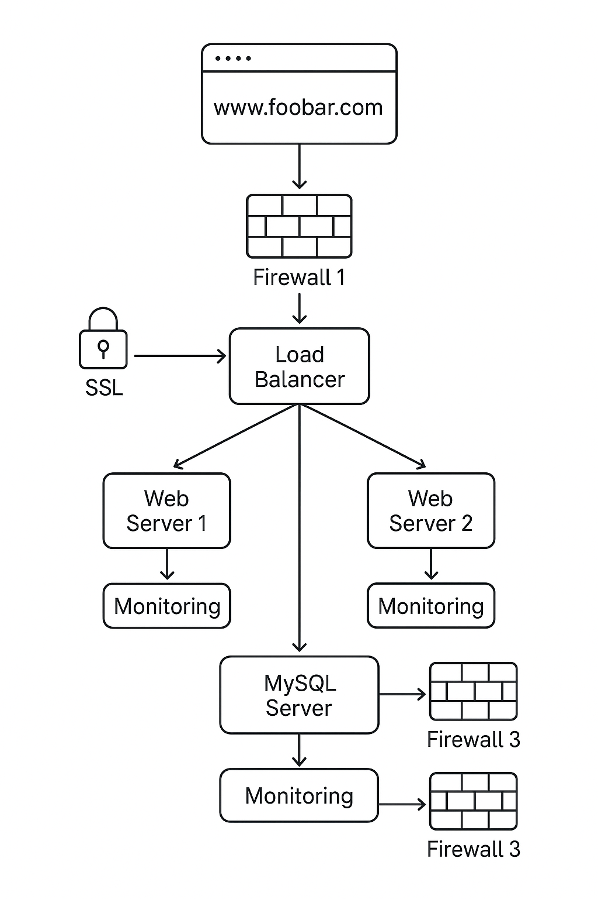

# Secured and monitored web infrastructure

## Required Components

1. **3 Firewalls**

- **Purpose**: Control and filter traffic. Protect servers from unauthorized access.

- Placement:

	1. In front of the load balancer (external network traffic filtering)

	2. Between web/app servers and database server (internal segmentation)

	3. Optional internal firewall on the database server for extra protection

2. **1 SSL Certificate**

- **Purpose**: Enables HTTPS for `www.foobar.com`, encrypts traffic to protect data in transit.

- Installed on the Load Balancer (SSL termination) so the web servers can receive decrypted traffic.

3. **3 Monitoring Clients**

- **Purpose**: Collect metrics (CPU, memory, disk usage, network traffic, HTTP requests, etc.).

Examples: Sumo Logic agent, Prometheus node exporter, Datadog agent.

Installed on: Each of the 3 servers.

---

## Explanations

**Why add each element**:

- **Load Balancer**: Distributes incoming traffic across the two web servers. Improves availability and scalability.

- **Web Servers**: Handle user requests and run the website.

- **Database Server**: Central storage for website data.

- **Monitoring Clients**: Provide visibility into system performance and application health.

**Firewalls**:

- Filter unwanted traffic.

- Protect servers from attacks like DDoS, SQL injection, etc.

**HTTPS**:

- Encrypts traffic between users and servers.

- Prevents eavesdropping and tampering.

- Required for user trust and SEO.

**Monitoring**:

- Collects system and application metrics.

- Can alert on issues like high CPU usage, downtime, or errors.

- Tools collect data via agents installed on servers that send metrics to a centralized platform.

**Monitoring QPS (Queries Per Second)**:

- Install a monitoring agent on the web servers or database server that tracks incoming requests.

- Use tools like Prometheus + Grafana or Sumologic to calculate QPS metrics in real-time.

---

## Potential Issues in This Setup

1. **Terminating SSL at Load Balancer**

- Issue: Traffic from LB → Web servers is unencrypted. Sensitive data could be exposed internally.

- Mitigation: Re-encrypt traffic between LB and web servers (SSL passthrough or internal certificates).

2. **Single MySQL Write Server**

- Issue: Single point of failure. If the server goes down, no writes can happen.

- Mitigation: Use MySQL replication or a cluster to handle failover and writes.

3. **Servers with all components (DB + Web + App)**

- Issue: Poor scalability, harder to secure, more complex maintenance.

- Mitigation: Use separate layers (e.g., dedicated DB server, app server, web server).