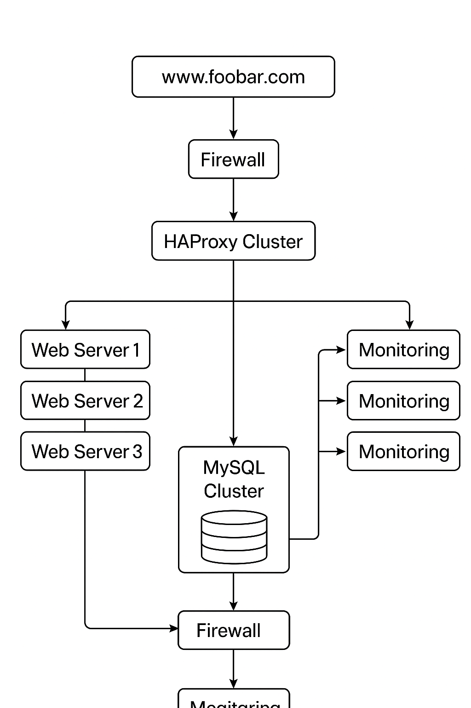

# Scale up

## Components

### 1. Server
- **Purpose:** Hosts the main application or website.
- **Reason for Adding:** A server is essential to run any service. Without it, the software has nowhere to execute.
- **Notes:** In production environments, a single server is not enough for high availability or load handling.

### 2. Load Balancer (HAProxy Cluster)
- **Purpose:** Distributes incoming network traffic across multiple servers to prevent overload and ensure high availability.
- **Reason for Adding:** 
  - Prevents any single server from becoming a bottleneck.
  - Provides redundancy: if one load balancer fails, the cluster ensures continued traffic flow.
- **Cluster Configuration:** At least two HAProxy instances running in active-passive or active-active mode.

### 3. Web Server (Separate Server)
- **Purpose:** Handles HTTP requests and serves static content (HTML, CSS, JavaScript, images).
- **Reason for Adding:** 
  - Offloads static content processing from the application server.
  - Improves performance and scalability.
- **Typical Software:** Apache, Nginx.

### 4. Application Server (Separate Server)
- **Purpose:** Processes dynamic content, executes business logic, and communicates with the database.
- **Reason for Adding:** 
  - Separates application logic from static content handling.
  - Enables horizontal scaling by adding more application servers independently.
- **Typical Software:** Tomcat, Node.js, Django, etc.

### 5. Database Server (Separate Server)
- **Purpose:** Stores persistent data such as user accounts, transactions, and application content.
- **Reason for Adding:** 
  - Separates data management from application logic for better performance, security, and maintainability.
  - Supports replication or clustering for high availability.
- **Typical Software:** MySQL, PostgreSQL, MongoDB.

## Benefits of Splitting Components Across Servers
- **Performance:** Each server is optimized for its specific role.
- **Scalability:** Web, application, and database servers can be scaled independently.
- **Security:** Limits access and reduces risks.
- **Maintenance:** Updates can be performed on one component without affecting others.

## Infrastructure Flow
1. Clients send HTTP requests to the **HAProxy Load Balancer**.
2. The load balancer forwards requests to available **Web Servers**.
3. Web servers serve static content or forward dynamic requests to the **Application Servers**.
4. Application servers process requests, interact with the **Database Server**, and send responses back.
5. HAProxy ensures traffic is balanced and redundant.

